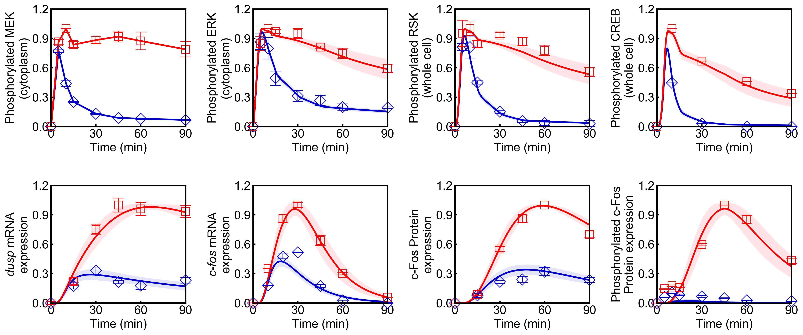

## Create an executable model

```python
from biomass.models import Nakakuki_Cell_2010

Nakakuki_Cell_2010.show_properties()
```

```
Model properties
----------------
36 species
115 parameters, of which 75 to be estimated
```

```python
model = Nakakuki_Cell_2010.create()
```

## Parameter Estimation of ODE Models (_n_ = 1, 2, 3, · · ·)

Parameters are adjusted to minimize the distance between model simulation and experimental data.

```python
from biomass import optimize

optimize(
    model=model, start=1, options={
        "popsize": 3,
        "max_generation": 1000,
        "allowable_error": 0.5,
        "local_search_method": "DE",
    }
)
```

The temporary result will be saved in `out/n/` after each iteration.

Progress list: `out/n/optimization.log`

```
Generation1: Best Fitness = 1.726069e+00
Generation2: Best Fitness = 1.726069e+00
Generation3: Best Fitness = 1.726069e+00
Generation4: Best Fitness = 1.645414e+00
Generation5: Best Fitness = 1.645414e+00
Generation6: Best Fitness = 1.645414e+00
Generation7: Best Fitness = 1.645414e+00
Generation8: Best Fitness = 1.645414e+00
Generation9: Best Fitness = 1.645414e+00
Generation10: Best Fitness = 1.645414e+00
Generation11: Best Fitness = 1.645414e+00
Generation12: Best Fitness = 1.645414e+00
Generation13: Best Fitness = 1.645414e+00
Generation14: Best Fitness = 1.645414e+00
Generation15: Best Fitness = 1.645414e+00
Generation16: Best Fitness = 1.249036e+00
Generation17: Best Fitness = 1.171606e+00
Generation18: Best Fitness = 1.171606e+00
Generation19: Best Fitness = 1.171606e+00
Generation20: Best Fitness = 1.171606e+00
```

- If you want to continue from where you stopped in the last parameter search,

```python
from biomass import optimize_continue

optimize_continue(
    model=model, start=1, options={
        "popsize": 3,
        "max_generation": 1000,
        "allowable_error": 0.5,
        "local_search_method": "DE",
    }
)
```

- If you want to search multiple parameter sets (e.g., from 1 to 10) simultaneously,

```python
from biomass import optimize

optimize(
    model=model, start=1, end=10, options={
        "popsize": 5,
        "max_generation": 2000,
        "allowable_error": 0.5,
        "local_search_method": "mutation",
        "n_children": 50
    }
)
```

- Exporting optimized parameters in CSV format

```python
from biomass.result import OptimizationResults

res = OptimizationResults(model)
res.to_csv()
```

## Visualization of Simulation Results

```python
from biomass import run_simulation

run_simulation(model, viz_type='average', show_all=False, stdev=True)
```

**viz_type** : _str_

- `'average'`
  : The average of simulation results with parameter sets in `out/`.

- `'best'`
  : The best simulation result in `out/`, simulation with `best_fit_param`.

- `'original'`
  : Simulation with the default parameters and initial values defined in `set_model.py`.

- `'n(=1,2,...)'`
  : Use the parameter set in `out/n/`.
- `'experiment'`
  : Draw the experimental data written in `observable.py` without simulation results.

**show_all** : _bool_

- Whether to show all simulation results.

**stdev** : _bool_

- If True, the standard deviation of simulated values will be shown (only when `viz_type == 'average'`).



Points (blue diamonds, EGF; red squares, HRG) denote experimental data, solid lines denote simulations

## Sensitivity Analysis

The single parameter sensitivity of each reaction is defined by

```math
C^{M}_{i} = d \ln{M} / d \ln{v_{i}}
```

where `v_{i}` is the `i^{th}` reaction rate, `v` is reaction vector `v` = (`v_{1}`, `v_{2}`, ...) and `M` is the signaling metric, e.g., time-integrated response, duration. Sensitivity coefficients were calculated using finite difference approximations with 1% changes in the reaction rates.

```python
from biomass import run_analysis

run_analysis(model, target='reaction', metric='integral', style='barplot')
```

**target** : _str_

- `'reaction'`
- `'initial_condition'`
- `'parameter'`

**metric** : _str_

- `'maximum'`
  : The maximum value.

- `'minimum'`
  : The minimum value.

- `'argmax'`
  : The time to reach the maximum value.

- `'argmin'`
  : The time to reach the minimum value.

- `'timepoint'`
  : The simulated value at the time point set via options['timepoint'].

- `'duration'`
  : The time it takes to decline below the threshold set via options['duration'].

- `'integral'`
  : The integral of concentration over the observation time.

**style** : _str_

- `'barplot'`
- `'heatmap'`


Control coefficients for integrated pc-Fos are shown by bars (blue, EGF; red, HRG). Numbers above bars indicate the reaction indices, and error bars correspond to simulation standard deviation.
